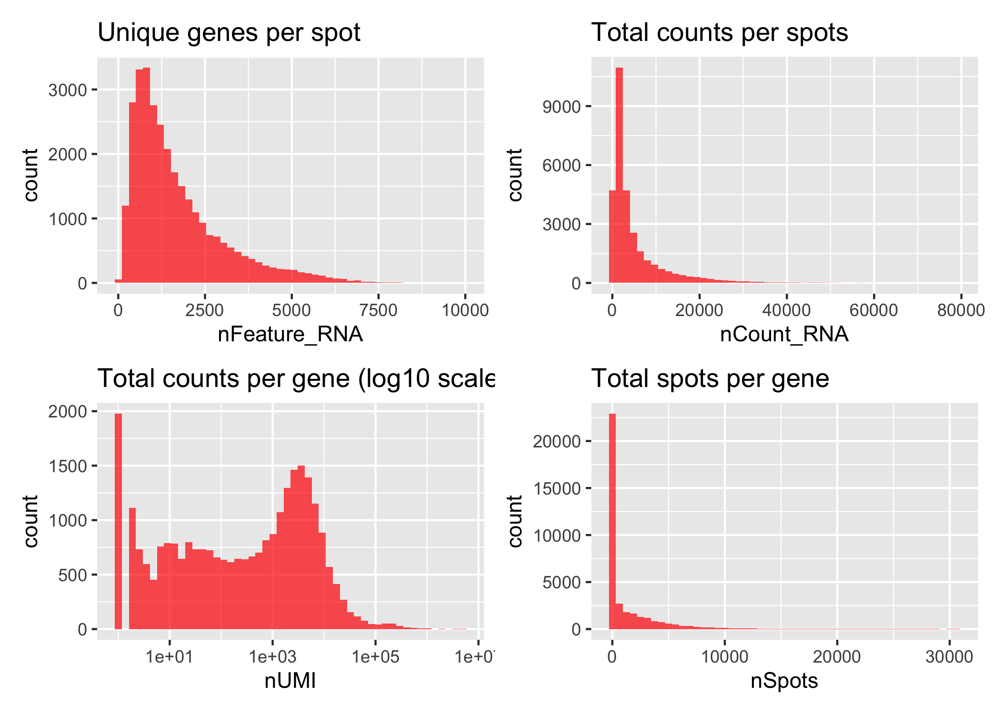

# Quality Control Spatial data

2024-06-17

### Load packages

``` r
##################
# LOAD LIBRARIES #
##################
library(tidyverse)
library(tidyseurat)
library(Seurat)
library(SeuratObject)
library(broom)
library(RColorBrewer)
library(cowplot)
library(patchwork)

source("../bin/spatial_visualization.R")
```

### Load ST data

``` r
#########
# PATHS #
#########
input_dir <- "../results/00_load_st_data/"
result_dir <- "../results/01_QC_st_data/"
if( isFALSE(dir.exists(result_dir)) ) { dir.create(result_dir,recursive = TRUE) }

#############
# LODA DATA #
#############
#metadata <- read_csv("../data/Clinincal_data_Spatial_DMPA.csv")
DATA <- readRDS(paste0(input_dir,"seuratObj_merged.RDS"))
sample_id <- c("P020","P045", "P050","P057",
               "P008", "P031", "P044", "P080", "P026", "P105", 
               "P001", "P004", "P014", "P018", "P087", "P108", "P118",
               "P021","P024", "P067", "P081", "P117" ) %>% set_names()

#################
# COLOUR PALLET #
#################
friendly_cols <- c("#4E79A7", "#F28E2B", "#E15759", "#76B7B2", "#59A14F", "#EDC948", "#9C755F", "#B07AA1", "#FF9DA7", "#E78AC3", "#7FC97F", "#BEAED4", "#BAB0AC", "#FDC086", "#FFFF99", "#386CB0", "#F0027F", "#BF5B17", "#666666", "#66C2A5", "#FC8D62", "#8DA0CB")
# "#A6D854" "#FFD92F" "#E5C494" "#B3B3B3"
```

``` r
###########################################
# QUALITY CONTROLL FEATURE & COUNTS PLOTS #
###########################################
p1 <- ggplot() +
  geom_histogram(data = DATA@meta.data, aes(nFeature_RNA), fill = "red", alpha = 0.7, bins = 50) +
  ggtitle("Unique genes per spot") 

p2 <- ggplot() +
  geom_histogram(data = DATA@meta.data, aes(nCount_RNA), fill = "red", alpha = 0.7, bins = 50) +
  ggtitle("Total counts per spots")

gene_attr <- data.frame(nUMI = Matrix::rowSums(assay_count), 
                        nSpots = Matrix::rowSums(assay_count > 0))

p3 <- ggplot() +
  geom_histogram(data = gene_attr, aes(nUMI), fill = "red", alpha = 0.7, bins = 50) +
  scale_x_log10() +
  ggtitle("Total counts per gene (log10 scale)")

p4 <- ggplot() +
  geom_histogram(data = gene_attr, aes(nSpots), fill = "red", alpha = 0.7,  bins = 50) +
  ggtitle("Total spots per gene")

plot_grid(ncol = 1, 
          p1 + p2 + p3 + p4)
```



### Add QC features to DATA

``` r
################################
# CALC. % MITO/RIBO/HEMO-GENES #
################################
DATA <- PercentageFeatureSet(DATA, "^MT-", col.name = "percent_mito")
DATA <- PercentageFeatureSet(DATA, "^HB[^(P)]", col.name = "percent_hb")
DATA <- PercentageFeatureSet(DATA, "^RP[SL]", col.name = "percent_ribo")
```

### Summary stats before filtering

``` r
#################
# SUMMARY STATS #
#################
feature <-  c("nCount_RNA", "nFeature_RNA","percent_mito","percent_hb", "percent_ribo")
sapply(DATA@meta.data[feature], summary) %>% 
  bind_rows(.id = "stat") %>% 
  knitr::kable(digits = 1)
```

| stat         | Min. |     1st Qu. |      Median |         Mean |      3rd Qu. |        Max. | NA’s |
|:-------------|-----:|------------:|------------:|-------------:|-------------:|------------:|-----:|
| nCount_RNA   |    0 | 1138.000000 | 2354.000000 | 4.997430e+03 | 5.769000e+03 | 79020.00000 |   NA |
| nFeature_RNA |    0 |  728.000000 | 1270.000000 | 1.686655e+03 | 2.235000e+03 |  9935.00000 |   NA |
| percent_mito |    0 |    3.747148 |    4.790501 | 5.076147e+00 | 6.174162e+00 |    31.83673 |    4 |
| percent_hb   |    0 |    0.000000 |    0.000000 | 5.208407e-02 | 2.483495e-02 |    25.09804 |    4 |
| percent_ribo |    0 |    9.090909 |   11.603086 | 1.192944e+01 | 1.442907e+01 |    35.33520 |    4 |

### Plot feature data on the tissue sections

``` r
# dev.new(width=12.5, height=12.5, noRStudioGD = TRUE)
# percentage of mitochondria
(plots_m <- DATA %>%
  plot_spatial.fun(., 
      sampleid = sample_id,
      save_space = T,
      geneid = "percent_mito",
      zoom = "zoom",
      ncol = 4,
      img_alpha = 0,
      point_size = .5)
    )
```


``` r
# number of genes per spot
(plots_f <- DATA %>%
  plot_spatial.fun(., 
      sampleid = sample_id,
      geneid = "nFeature_RNA",
      zoom = "zoom",
      ncol = 4,
      img_alpha = 0,
      point_size = .5)
    )
```


``` r
# number of reads per spot
(plots_c <- DATA %>%
  plot_spatial.fun(., 
      sampleid = sample_id,
      geneid = "nCount_RNA",
      zoom = "zoom",
      ncol = 4,
      img_alpha = 0,
      point_size = .5)
    )
```


## Filtering

Select all spots with less than 15% mitochondrial reads, less than 10%
hb-reads and at least 100 detected genes.<br/> Filter genes present in
less than 2 spots and remove hemoglobin and MALAT1 genes.

``` r
##########################
# FILTER GENES AND CELLS #
##########################
# filter genes present in less than 2 spots:
filt_low_genes <- function(x, n_cell = 2) x[rowSums(x) >= n_cell]
# remove specified genes:
remove_genes <- function(x, gene_name) x[!(grepl(gene_name, rownames(x[["RNA"]]))), ]
# identify transcripts within the 0.005 percentile:
percentile <- function(x, nF) between(nF,quantile(nF,probs = c(0.005)), quantile(nF,probs = c(0.995)))


DATA <- DATA %>%
  # filter out spots with less than 100 genes and more than 15% mt and 10% hb:
  mutate(filt = case_when(nFeature_RNA < 100 ~ 'filt',
                          percent_mito > 20 ~ 'filt',
                          percent_hb > 10 ~ 'filt',
                              TRUE ~ "keep")) %>%
  mutate(orig.ident = factor(.$orig.ident, levels = sample_id)) %>%
  {. ->> temp } %>%
  #filter(., percentile(., .$nFeature_RNA)) %>%
  filter(filt == "keep") %>%
  filt_low_genes(., n_cell = 2) %>%
  remove_genes(., "MALAT1|^HB[^(P)]") %>% # "^MT-|MALAT1|^HB[^(P)]"
  select(-filt)
```

### Summary stats after filtering

Dimension of DATA before filtering, genes: 36601, spots: 30794<br/>
Dimension of DATA after filtering, genes: 25720, spots: 30724

``` r
###########################
# SUMMARY STATS ALL SPOTS #
###########################
feature <-  c("nCount_RNA", "nFeature_RNA","percent_mito","percent_hb", "percent_ribo")
sapply(DATA@meta.data[feature], summary) %>% 
  as_tibble(rownames = "stat") %>% 
  knitr::kable(digits = 1)
```

| stat    | nCount_RNA | nFeature_RNA | percent_mito | percent_hb | percent_ribo |
|:--------|-----------:|-------------:|-------------:|-----------:|-------------:|
| Min.    |      111.0 |        101.0 |          0.0 |        0.0 |          1.8 |
| 1st Qu. |     1121.0 |        729.0 |          3.7 |        0.0 |          9.1 |
| Median  |     2334.0 |       1271.0 |          4.8 |        0.0 |         11.6 |
| Mean    |     4978.8 |       1687.9 |          5.1 |        0.0 |         11.9 |
| 3rd Qu. |     5736.0 |       2236.0 |          6.2 |        0.0 |         14.4 |
| Max.    |    78987.0 |       9932.0 |         19.9 |        9.5 |         35.3 |

``` r
#########################
# SUMMARY STATS GROUPS #
#########################
DATA@meta.data %>%
  split(.$groups, drop = T) %>% 
  map(., ~.x %>%
        select(., any_of(feature[1:2])) %>%
        map(~tidy(summary(.x))) %>%
        bind_rows(.id = "stat")
        #tibble(.x, .name_repair="unique")
      ) %>%
  bind_rows(., .id = "groups") %>%
  arrange(stat) %>%
  knitr::kable(digits = 1)
```

| groups | stat         | minimum |     q1 | median |   mean |     q3 | maximum |
|:-------|:-------------|--------:|-------:|-------:|-------:|-------:|--------:|
| L1     | nCount_RNA   |     121 |  945.0 | 2175.5 | 4431.9 | 4892.0 |   78987 |
| L2     | nCount_RNA   |     125 | 1404.0 | 2884.0 | 5845.0 | 6771.0 |   68879 |
| L3     | nCount_RNA   |     111 | 1620.0 | 3282.5 | 6246.7 | 8548.0 |   70703 |
| L4     | nCount_RNA   |     113 |  758.0 | 1422.0 | 3330.8 | 3131.5 |   68496 |
| L1     | nFeature_RNA |     103 |  668.0 | 1237.0 | 1613.0 | 2186.2 |    8138 |
| L2     | nFeature_RNA |     109 |  871.0 | 1438.0 | 1863.7 | 2387.0 |    8201 |
| L3     | nFeature_RNA |     101 |  960.0 | 1622.0 | 2042.4 | 2810.0 |    9932 |
| L4     | nFeature_RNA |     101 |  526.5 |  863.0 | 1210.4 | 1525.0 |    7963 |

### Plotting QC after filtering

``` r
# dev.new(width=6, height=5, noRStudioGD = TRUE)
################################
# VIOLIN PLOT BEFORE FILTERING #
################################
feature <-  c("nCount_RNA", "nFeature_RNA","percent_mito","percent_hb", "percent_ribo")
p_ <-  map(feature, 
           ~violin.fun(temp, feature=.x, fill="orig.ident", 
                       col_pal=friendly_cols, txt_size=15, n=1.5))
# plot_grid(plotlist=p_, ncol = 1)

################################
# VIOLIN PLOT AFTER FILTERING #
################################
p <-  map(feature, 
          ~violin.fun(DATA, feature=.x, fill="orig.ident",
                      col_pal=friendly_cols, txt_size=15, n=1.5)) #
#plot_grid(plotlist=c(p_, p), nrow = 5, byrow = F)
plot_grid(plotlist=c(p), ncol = 1, byrow = F)
```


### Filtered spots

``` r
temp %>%
  filter(filt == "filt") %>%
  arrange(nFeature_RNA) %>%
  as_tibble() %>%
  knitr::kable(digits = 1)
```

| .cell                 | groups | Tissue_gr_v3 | sp_annot | orig.ident | nCount_RNA | nFeature_RNA | percent_mito | percent_hb | percent_ribo | filt |
|:----------------------|:-------|:-------------|:---------|:-----------|-----------:|-------------:|-------------:|-----------:|-------------:|:-----|
| P001_AGCTCCTTCGCACATC | L3     | T3           | SubMuc   | P001       |       2843 |         1398 |          3.7 |       10.4 |         10.6 | filt |
| P001_ATTGTACAACTCGGCT | L3     | T3           | SubMuc   | P001       |       4873 |         1979 |          6.0 |       11.0 |         14.8 | filt |
| P001_CAATATTCTTGACCTA | L3     | T3           | SubMuc   | P001       |       1345 |          758 |          6.2 |       10.0 |         13.2 | filt |
| P001_TACCGGTCGTTTCCAT | L3     | T3           | SubMuc   | P001       |         92 |           77 |          6.5 |        0.0 |         14.1 | filt |
| P001_TATTCCGAGCTGTTAT | L3     | T3           | SubMuc   | P001       |       1395 |          747 |          4.6 |       12.3 |         13.0 | filt |
| P001_TCGTGTACTATGGATG | L3     | T3           | SubMuc   | P001       |         90 |           79 |          3.3 |        0.0 |         12.2 | filt |
| P014_AGAAGAGCGCCGTTCC | L3     | T3           | SubMuc   | P014       |         58 |           47 |          3.4 |        0.0 |          6.9 | filt |
| P014_CGTGTATGGGAGCTGA | L3     | T3           | SubMuc   | P014       |         46 |           46 |          2.2 |        0.0 |         19.6 | filt |
| P014_GCATCGGCCGTGTAGG | L3     | T3           | SubMuc   | P014       |        105 |           97 |          1.9 |        0.0 |          6.7 | filt |
| P014_TCGCGTAGCAGTGTCC | L3     | T3           | SubMuc   | P014       |         10 |           10 |          0.0 |        0.0 |          0.0 | filt |
| P014_TCGTGTACTATGGATG | L3     | T3           | SubMuc   | P014       |         18 |           18 |          0.0 |        0.0 |         11.1 | filt |
| P018_GCACGCCTACTTAGAT | L3     | T3           | SubMuc   | P018       |        765 |          397 |          8.6 |       25.1 |         12.8 | filt |
| P018_GTGTATATCAGCGGGC | L3     | T3           | SubMuc   | P018       |        561 |          333 |         10.0 |       14.1 |         16.9 | filt |
| P018_TACCGGTCGTTTCCAT | L3     | T3           | SubMuc   | P018       |        104 |           80 |          4.8 |        0.0 |         24.0 | filt |
| P018_TATCCAATTGGTTATC | L3     | T3           | SubMuc   | P018       |       1060 |          566 |          5.9 |       12.6 |         13.8 | filt |
| P018_TTCGGGCGCTAGTCTT | L3     | T3           | SubMuc   | P018       |        666 |          392 |          6.0 |       12.8 |         14.0 | filt |
| P020_AGGGTCAGTAACCCTA | L1     | T1           | epi      | P020       |        894 |          488 |         21.7 |        0.0 |         10.9 | filt |
| P020_ATACCGTCATCCATAA | L1     | T1           | epi      | P020       |       1071 |          629 |         22.2 |        0.0 |          6.3 | filt |
| P020_CATGTAGGAGCGCCAA | L1     | T1           | epi      | P020       |        245 |          158 |         31.8 |        0.0 |          7.3 | filt |
| P020_GACGTGTAGGGATTAT | L1     | T1           | SubMuc   | P020       |         93 |           86 |          2.2 |        0.0 |         11.8 | filt |
| P020_GGCTTTCAATAAGGGT | L1     | T1           | SubMuc   | P020       |         89 |           77 |         12.4 |        0.0 |          9.0 | filt |
| P020_TACCGGTCGTTTCCAT | L1     | T1           | SubMuc   | P020       |         19 |           12 |          5.3 |        0.0 |         10.5 | filt |
| P020_TATAGAGTCGCTTGAA | L1     | T1           | SubMuc   | P020       |         28 |           26 |          3.6 |        0.0 |          7.1 | filt |
| P020_TCGAGACCAACACCGT | L1     | T1           | SubMuc   | P020       |        106 |           96 |          9.4 |        0.0 |         10.4 | filt |
| P020_TGGCTTGTACAAGCTT | L1     | T1           | epi      | P020       |       1061 |          640 |         21.7 |        0.0 |          5.8 | filt |
| P021_AGAAGAGCGCCGTTCC | L4     | T4           | SubMuc   | P021       |         45 |           36 |          6.7 |        0.0 |          4.4 | filt |
| P021_ATCGTTAGCTAGCGGA | L4     | T4           | SubMuc   | P021       |         94 |           85 |          4.3 |        0.0 |         16.0 | filt |
| P021_CACTCTTCTGCTAGCC | L4     | T4           | SubMuc   | P021       |        108 |           95 |          3.7 |        0.0 |          7.4 | filt |
| P021_CCACTGTTTGGATTAA | L4     | T4           | SubMuc   | P021       |         79 |           75 |          6.3 |        0.0 |         19.0 | filt |
| P021_CGCCGTTCAGCATAGT | L4     | T4           | SubMuc   | P021       |         92 |           84 |          2.2 |        0.0 |         14.1 | filt |
| P021_CTAACTGATAATCGCC | L4     | T4           | SubMuc   | P021       |        107 |           95 |          4.7 |        0.0 |          8.4 | filt |
| P021_CTTTGCATCGCTCTTG | L4     | T4           | SubMuc   | P021       |        103 |           92 |          2.9 |        0.0 |          8.7 | filt |
| P021_GCATCGGCCGTGTAGG | L4     | T4           | SubMuc   | P021       |         28 |           28 |         10.7 |        0.0 |          7.1 | filt |
| P021_GGAGCAACATTTCAAG | L4     | T4           | SubMuc   | P021       |         91 |           76 |          3.3 |        0.0 |         17.6 | filt |
| P021_TCGCGTAGCAGTGTCC | L4     | T4           | SubMuc   | P021       |          6 |            6 |          0.0 |        0.0 |         33.3 | filt |
| P021_TCGTGTACTATGGATG | L4     | T4           | SubMuc   | P021       |         35 |           33 |          0.0 |        0.0 |         17.1 | filt |
| P021_TCGTGTTCGACCACAA | L4     | T4           | SubMuc   | P021       |         47 |           47 |          2.1 |        0.0 |         19.1 | filt |
| P024_AGAAGAGCGCCGTTCC | L4     | T4           | SubMuc   | P024       |         90 |           77 |         11.1 |        0.0 |         26.7 | filt |
| P024_CGTGCAGACTGGGACA | L4     | T4           | SubMuc   | P024       |          0 |            0 |          NaN |        NaN |          NaN | filt |
| P024_CTCACTTGGCTGGTAA | L4     | T4           | epi      | P024       |          0 |            0 |          NaN |        NaN |          NaN | filt |
| P024_GTAAGTAACAGTCTGG | L4     | T4           | SubMuc   | P024       |          1 |            1 |          0.0 |        0.0 |          0.0 | filt |
| P024_GTCTATCTGAGTTTCT | L4     | T4           | SubMuc   | P024       |          0 |            0 |          NaN |        NaN |          NaN | filt |
| P024_TACCGGTCGTTTCCAT | L4     | T4           | SubMuc   | P024       |         40 |           35 |          5.0 |        0.0 |         25.0 | filt |
| P024_TACGCCATATTCTAAT | L4     | T4           | SubMuc   | P024       |          0 |            0 |          NaN |        NaN |          NaN | filt |
| P024_TCGTGTACTATGGATG | L4     | T4           | SubMuc   | P024       |         76 |           70 |          9.2 |        0.0 |         22.4 | filt |
| P026_ACCACAAGTTTCTATC | L2     | T2           | epi      | P026       |      11388 |         3861 |         20.7 |        0.1 |          4.9 | filt |
| P026_CGGGTGTACCCATTTA | L2     | T2           | epi      | P026       |       8225 |         2796 |         20.0 |        0.0 |          6.0 | filt |
| P026_GGATGTCCTTACCGCA | L2     | T2           | epi      | P026       |       8382 |         3049 |         22.4 |        0.0 |          6.9 | filt |
| P026_GGATTTCACTTCTATA | L2     | T2           | epi      | P026       |       5819 |         2001 |         21.4 |        0.0 |          4.5 | filt |
| P026_TCGTGTACTATGGATG | L2     | T2           | SubMuc   | P026       |         82 |           63 |         12.2 |        0.0 |         11.0 | filt |
| P026_TGCAAGAATGACGTAA | L2     | T2           | epi      | P026       |       8361 |         2738 |         21.8 |        0.0 |          4.6 | filt |
| P026_TTAATGTAGACCAGGT | L2     | T2           | epi      | P026       |       4796 |         1851 |         21.2 |        0.1 |          4.3 | filt |
| P026_TTCTAACCGAAGCTTA | L2     | T2           | epi      | P026       |       8144 |         2914 |         20.7 |        0.0 |          5.6 | filt |
| P031_AGAAGAGCGCCGTTCC | L2     | T3           | SubMuc   | P031       |         30 |           29 |          3.3 |        0.0 |         10.0 | filt |
| P057_AGAAGAGCGCCGTTCC | L1     | T2           | SubMuc   | P057       |         24 |           24 |          8.3 |        0.0 |         16.7 | filt |
| P057_TCGCGTAGCAGTGTCC | L1     | T2           | SubMuc   | P057       |         44 |           41 |          9.1 |        0.0 |          9.1 | filt |
| P067_TACCGGTCGTTTCCAT | L4     | NA           | SubMuc   | P067       |         49 |           47 |          6.1 |        0.0 |         16.3 | filt |
| P080_AGAAGAGCGCCGTTCC | L2     | T2           | SubMuc   | P080       |         48 |           39 |          2.1 |        0.0 |          8.3 | filt |
| P080_TCGTGTACTATGGATG | L2     | T2           | SubMuc   | P080       |         17 |           17 |          0.0 |        0.0 |          5.9 | filt |
| P105_AGAAGAGCGCCGTTCC | L2     | T2           | SubMuc   | P105       |         63 |           62 |         11.1 |        0.0 |         19.0 | filt |
| P108_CATGGTAAGTAGCGTT | L3     | T3           | SubMuc   | P108       |         88 |           82 |          2.3 |        0.0 |         17.0 | filt |
| P117_AAAGGGCAGCTTGAAT | L4     | T4           | SubMuc   | P117       |         58 |           49 |         10.3 |        0.0 |         15.5 | filt |
| P117_AGAAGAGCGCCGTTCC | L4     | T4           | SubMuc   | P117       |         50 |           45 |          8.0 |        0.0 |          8.0 | filt |
| P117_CGAGCACTTCAAGTTT | L4     | T4           | SubMuc   | P117       |         31 |           27 |          9.7 |        0.0 |         16.1 | filt |
| P117_GATTCCTATACGGCGC | L4     | T4           | SubMuc   | P117       |         84 |           77 |          4.8 |        0.0 |         10.7 | filt |
| P117_GCTAAACCTGAGGTGA | L4     | T4           | SubMuc   | P117       |        100 |           83 |          8.0 |        0.0 |         13.0 | filt |
| P117_TCGTGTACTATGGATG | L4     | T4           | epi      | P117       |        125 |           99 |         10.4 |        0.0 |          9.6 | filt |
| P117_TTAACACCTCGAACAT | L4     | T4           | SubMuc   | P117       |         87 |           73 |          6.9 |        0.0 |         14.9 | filt |
| P117_TTACCCTAACAGTCCT | L4     | T4           | SubMuc   | P117       |         36 |           35 |          8.3 |        0.0 |         11.1 | filt |
| P118_CATGGTAAGTAGCGTT | L3     | T3           | SubMuc   | P118       |         14 |           13 |          0.0 |        0.0 |          0.0 | filt |

### Plot filtered spots

``` r
# dev.new(width=12.5, height=12.5, noRStudioGD = TRUE)
(plots <- temp %>%
  plot_spatial.fun(., 
      sampleid = sample_id,
      geneid = "filt",
      zoom = "zoom",
      ncol = 4,
      img_alpha = 0,
      point_size = 0.5)
    )
```


### Plot top expressed genes

``` r
#############################
# GET TOP 20 ABUNDANT GENES #
#############################
top_genes <- assay_count %>%
  Matrix::rowSums(.) %>%
  sort(., decreasing = T) %>%
  .[1:20]

percent.fun <- function(df, sample_name, gene, count){
  sample_name <- enquo(sample_name)
  gene <- enquo(gene)
  count <- enquo(count)

  percent <- df %>%
    select(!!sample_name, !!gene, !!count) %>%
    group_by(!!sample_name) %>%
    mutate(Percent = (!!count/sum(!!count)*100)) %>%
    select(-!!count) %>%
    ungroup() 
  
  return(percent$Percent)
}
col = (scales::hue_pal())(20)[20:1]

##################
# PLOT TOP GENES #
##################
(genes_plot <- DATA %>%
   join_features(features = names(top_genes) ) %>%
   mutate(.feature = factor(.feature, levels = rev(names(top_genes)))) %>%
   mutate("% total count per spot" = percent.fun(., .cell, .feature, .abundance_RNA),
          .after=.abundance_RNA) %>%
   ggplot(aes(y=`% total count per spot`, x=.feature, fill=.feature)) +
   stat_boxplot(geom = "errorbar", width = 0.2) +
   geom_boxplot(outlier.alpha = 0.1, outlier.size = .5) +
   scale_fill_manual(values = col) + my_theme +
   theme(plot.title = element_text(hjust = 0.5),
         axis.title.y = element_blank()) +
   NoLegend() + coord_flip() )
```


## Save seurat object

``` r
##################################
# SAVE INTERMEDIATE SEURAT OJECT #
##################################
saveRDS(DATA, paste0(result_dir,"seuratObj_filtered.RDS"))
# saveRDS(DATA, paste0(result_dir,"seuratObjV5_filtered.RDS"))
# DATA <- readRDS(paste0(result_dir,"seuratObj_filtered.RDS"))
```

### Session info

``` r
sessionInfo()
```

    R version 4.4.0 (2024-04-24)
    Platform: x86_64-apple-darwin20
    Running under: macOS Sonoma 14.5

    Matrix products: default
    BLAS:   /Library/Frameworks/R.framework/Versions/4.4-x86_64/Resources/lib/libRblas.0.dylib 
    LAPACK: /Library/Frameworks/R.framework/Versions/4.4-x86_64/Resources/lib/libRlapack.dylib;  LAPACK version 3.12.0

    locale:
    [1] en_US.UTF-8/en_US.UTF-8/en_US.UTF-8/C/en_US.UTF-8/en_US.UTF-8

    time zone: Europe/Oslo
    tzcode source: internal

    attached base packages:
    [1] stats     graphics  grDevices utils     datasets  methods   base     

    other attached packages:
     [1] geomtextpath_0.1.4     directlabels_2024.1.21 patchwork_1.2.0       
     [4] cowplot_1.1.3          RColorBrewer_1.1-3     broom_1.0.6           
     [7] Seurat_4.4.0           tidyseurat_0.8.0       SeuratObject_5.0.2    
    [10] sp_2.1-4               ttservice_0.4.0        lubridate_1.9.3       
    [13] forcats_1.0.0          stringr_1.5.1          dplyr_1.1.4           
    [16] purrr_1.0.2            readr_2.1.5            tidyr_1.3.1           
    [19] tibble_3.2.1           ggplot2_3.5.1          tidyverse_2.0.0       

    loaded via a namespace (and not attached):
      [1] rstudioapi_0.16.0      jsonlite_1.8.8         magrittr_2.0.3        
      [4] spatstat.utils_3.0-4   farver_2.1.2           rmarkdown_2.27        
      [7] fs_1.6.4               vctrs_0.6.5            ROCR_1.0-11           
     [10] spatstat.explore_3.2-7 htmltools_0.5.8.1      sctransform_0.4.1     
     [13] parallelly_1.37.1      KernSmooth_2.23-24     htmlwidgets_1.6.4     
     [16] ica_1.0-3              plyr_1.8.9             plotly_4.10.4         
     [19] zoo_1.8-12             igraph_2.0.3           mime_0.12             
     [22] lifecycle_1.0.4        pkgconfig_2.0.3        Matrix_1.7-0          
     [25] R6_2.5.1               fastmap_1.2.0          fitdistrplus_1.1-11   
     [28] future_1.33.2          shiny_1.8.1.1          digest_0.6.35         
     [31] colorspace_2.1-0       tensor_1.5             irlba_2.3.5.1         
     [34] textshaping_0.4.0      labeling_0.4.3         progressr_0.14.0      
     [37] fansi_1.0.6            spatstat.sparse_3.0-3  timechange_0.3.0      
     [40] httr_1.4.7             polyclip_1.10-6        abind_1.4-5           
     [43] compiler_4.4.0         withr_3.0.0            backports_1.5.0       
     [46] MASS_7.3-60.2          tools_4.4.0            lmtest_0.9-40         
     [49] httpuv_1.6.15          future.apply_1.11.2    goftest_1.2-3         
     [52] glue_1.7.0             quadprog_1.5-8         nlme_3.1-164          
     [55] promises_1.3.0         grid_4.4.0             Rtsne_0.17            
     [58] cluster_2.1.6          reshape2_1.4.4         generics_0.1.3        
     [61] gtable_0.3.5           spatstat.data_3.0-4    tzdb_0.4.0            
     [64] data.table_1.15.4      hms_1.1.3              utf8_1.2.4            
     [67] spatstat.geom_3.2-9    RcppAnnoy_0.0.22       ggrepel_0.9.5         
     [70] RANN_2.6.1             pillar_1.9.0           spam_2.10-0           
     [73] later_1.3.2            splines_4.4.0          lattice_0.22-6        
     [76] survival_3.6-4         deldir_2.0-4           tidyselect_1.2.1      
     [79] miniUI_0.1.1.1         pbapply_1.7-2          knitr_1.46            
     [82] gridExtra_2.3          scattermore_1.2        xfun_0.44             
     [85] matrixStats_1.3.0      stringi_1.8.4          lazyeval_0.2.2        
     [88] yaml_2.3.8             evaluate_0.23          codetools_0.2-20      
     [91] cli_3.6.2              uwot_0.2.2             xtable_1.8-4          
     [94] reticulate_1.37.0      systemfonts_1.1.0      munsell_0.5.1         
     [97] Rcpp_1.0.12            globals_0.16.3         spatstat.random_3.2-3 
    [100] png_0.1-8              parallel_4.4.0         ellipsis_0.3.2        
    [103] dotCall64_1.1-1        listenv_0.9.1          viridisLite_0.4.2     
    [106] scales_1.3.0           ggridges_0.5.6         leiden_0.4.3.1        
    [109] rlang_1.1.3           
