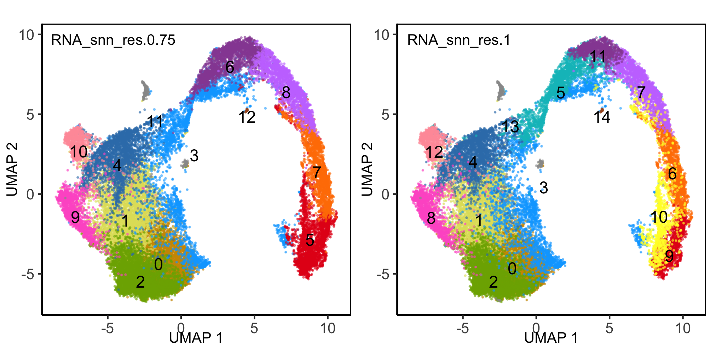
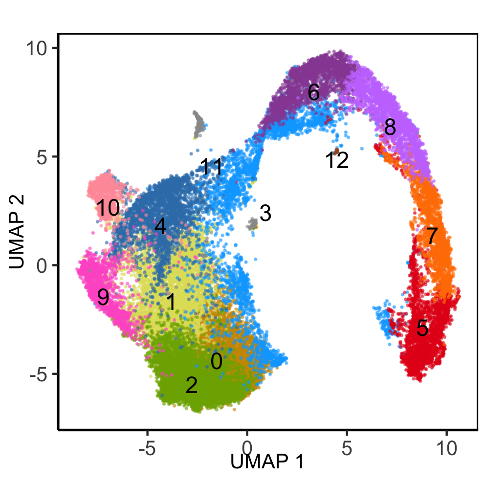
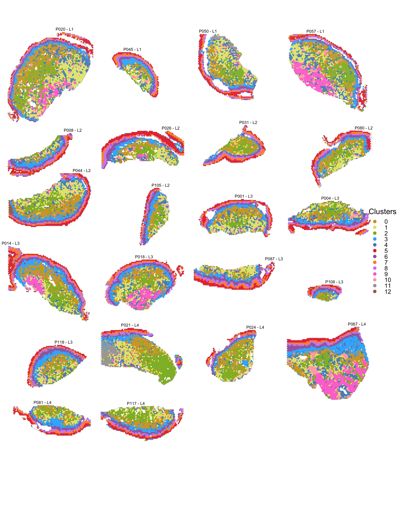
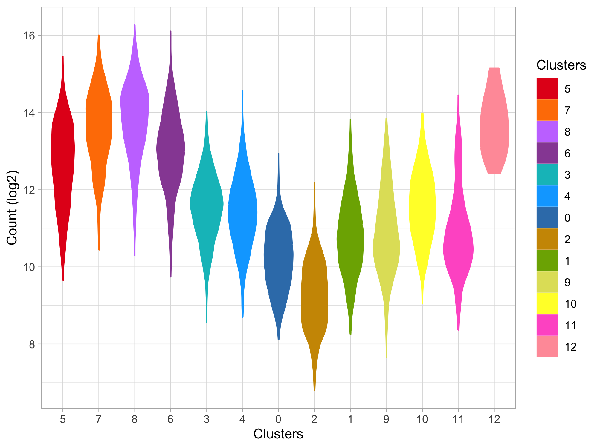

# Clustering filtered spatial data

2024-06-19

### Load data and libraries

``` r
##################
# LOAD LIBRARIES #
##################
library(tidyverse)
library(Seurat)
library(tidyseurat)
library(cowplot)
library(patchwork)

source("../bin/spatial_visualization.R")
source("../bin/plotting_functions.R")

#########
# PATHS #
#########
input_dir <- "../results/02_integrate_st_data/"
result_dir <- "../results/03_clustering_st_data/"
if( isFALSE(dir.exists(result_dir)) ) { dir.create(result_dir,recursive = TRUE) }

#############
# LODA DATA #
#############
DATA <- readRDS(paste0(input_dir,"seuratObj_integrated.RDS"))

#################
# COLOUR PALLET #
#################
clus_0.75 <- c("#CD9600","#e0e067","#7CAE00","#00A9FF","#377EB8","#E41A1C","#984EA3",
               "#FF7F00","#C77CFF","#FF61CC","#FF9DA7","#999999","#A65628","#B07AA1", "#FF9DA7")
clus_1 <- c("#CD9600","#e0e067","#7CAE00","#00A9FF","#377EB8","#00BFC4","#FF7F00","#C77CFF",
            "#FF61CC","#E41A1C","#FFFF33","#984EA3","#FF9DA7","#999999","#A65628")
```

## Clustering

``` r
##################################
# EVALUATE CLUSTERING RESOLUTION #
##################################
DATA <- FindNeighbors(DATA, reduction = "harmony", dims = 1:30, k.param = 15, prune.SNN = 1/15) 

# Clustering with louvain (algorithm 1) or leiden (algorithm 4)
for (res in c(0.1, 0.5, 0.75, 1, 1.5)) {
    DATA <- FindClusters(DATA, resolution = res, algorithm = 1)
}
```

    Modularity Optimizer version 1.3.0 by Ludo Waltman and Nees Jan van Eck

    Number of nodes: 30724
    Number of edges: 1141964

    Running Louvain algorithm...
    Maximum modularity in 10 random starts: 0.9398
    Number of communities: 5
    Elapsed time: 6 seconds
    Modularity Optimizer version 1.3.0 by Ludo Waltman and Nees Jan van Eck

    Number of nodes: 30724
    Number of edges: 1141964

    Running Louvain algorithm...
    Maximum modularity in 10 random starts: 0.8547
    Number of communities: 11
    Elapsed time: 7 seconds
    Modularity Optimizer version 1.3.0 by Ludo Waltman and Nees Jan van Eck

    Number of nodes: 30724
    Number of edges: 1141964

    Running Louvain algorithm...
    Maximum modularity in 10 random starts: 0.8233
    Number of communities: 13
    Elapsed time: 7 seconds
    Modularity Optimizer version 1.3.0 by Ludo Waltman and Nees Jan van Eck

    Number of nodes: 30724
    Number of edges: 1141964

    Running Louvain algorithm...
    Maximum modularity in 10 random starts: 0.8014
    Number of communities: 15
    Elapsed time: 9 seconds
    Modularity Optimizer version 1.3.0 by Ludo Waltman and Nees Jan van Eck

    Number of nodes: 30724
    Number of edges: 1141964

    Running Louvain algorithm...
    Maximum modularity in 10 random starts: 0.7630
    Number of communities: 17
    Elapsed time: 7 seconds

``` r
# each time you run clustering, the data is stored in meta data columns:
# seurat_clusters - lastest results only RNA_snn_res.XX - for each different
# resolution you test.
```

### UMAP of cluster resolutions

``` r
# dev.new(width=6.6929133858, height=3.3, noRStudioGD = TRUE)
res <- c("RNA_snn_res.0.75", "RNA_snn_res.1")
p <- map2(res, list(clus_0.75, clus_1),
          ~plot_clusters.fun(DATA, cluster=.x, txt_size = 10, dot_size = 0.2,
                             color = .y, red = "umapharmony") + xlab("UMAP 1") + ylab("UMAP 2")) 
plot_grid(ncol = 2, 
          plotlist = p)
```



### Cluster resolutions on tissue

``` r
# dev.new(width=6.6929133858, height=14, noRStudioGD = TRUE)
plots <- DATA %>%
  mutate(group = orig.ident) %>%
  nest(., data = -group) %>%
  mutate( "res_1" = pmap(., 
    ~plot_spatial.fun(..2, sampleid=..1, geneid="RNA_snn_res.0.75", 
                      point_size = 0.7, zoom="zoom", colors = clus_0.75))) %>%
  mutate( "res_2" = pmap(., 
    ~plot_spatial.fun(..2, sampleid=..1, geneid="RNA_snn_res.1", 
                      point_size = 0.7, zoom="zoom", colors = clus_1)))

legend_1 <- get_legend(plots$res_1[[2]] + theme(legend.position="right"))
legend_2 <- get_legend(plots$res_2[[1]] + theme(legend.position="right"))
legend <- plot_grid( legend_1, legend_2, ncol = 1)
combined <- wrap_plots(plotlist=c(plots$res_1, plots$res_2), nrow = 22, byrow = F) & theme(legend.position="none")
combined <- plot_grid( combined, legend, ncol = 2, rel_widths = c(1, .3)) 
combined
```


### Set cluster resolution

``` r
DATA <- DATA %>%
  rename(Clusters="RNA_snn_res.0.75") %>%
  rename(Clusters_1.0="RNA_snn_res.1") %>%
  SetIdent(., value = "Clusters") %>%
  select(-any_of(contains(c("RNA_snn_res","seurat_clusters"))))
```

``` r
# dev.new(width=3.3, height=3.3, noRStudioGD = TRUE)
p[[1]] + ggtitle("")
```



### Plot final clusters on tissue section:

``` r
# Horizontal (aspect = width/height)
# dev.new(width=12.5, height=12.5, noRStudioGD = TRUE)
############################
# PLOT FACET WRAP CLUSTERS #
############################
(p <- plot_st_meta.fun( DATA,
        feat =  "Clusters",
        zoom = "zoom",
        colors = clus_0.75,
        alpha = .9,
        ncol = 4,
        #annot_col = "#dbd9d9",
        annot_line = .1,
        img_alpha = 0,
        point_size = .6))
```



``` r
###################
# ADD ANNOTATION #
##################
#ord1 <- c("Superficial", "Upper IM", "Lower IM", "Basal","5","3","4","0","2","1","10","8","12","13","14")
#ord2 <- c("9", "6", "7", "11","5","3","4","0","2","1","10","8","12","13","14")
ord1 <- c("Superficial", "Upper IM", "Lower IM", "Basal","3","4","0","2","1","9","10","11","12")
ord2 <- c("5", "7", "8", "6","3","4","0","2","1","9","10","11","12")

epi_layers <- set_names(ord1, ord2)

DATA <- DATA %>%
mutate(layers = factor(epi_layers[as.character(.$Clusters)], levels = ord1), .after = "orig.ident")
```

### Spot distribution by clusters

``` r
DATA_sub <- as_tibble(DATA) %>%
  mutate(gr = .$groups) %>%
  mutate(ID = .$orig.ident) %>%
  nest(., data=-c(gr, orig.ident)) %>%
  mutate(epi =  map(data, ~filter(.x, !(sp_annot == "SubMuc"))),
         subMuc =  map(data, ~filter(.x, sp_annot == "SubMuc"))) %>%
  mutate(across(c("epi", "subMuc"), ~map(., ~table(.x$Clusters)), .names = "{.col}_n_before")) %>%
  mutate(across(contains("_n_"), ~set_names(.x, paste0(.data[["gr"]],"_",.data[["orig.ident"]]))))
      
table(DATA$Clusters)

t <- list(DATA_sub$epi_n_before, DATA_sub$subMuc_n_before) %>%
  map(., ~ .x %>%
        bind_cols("Clus" = paste0("**",names(table(DATA$Clusters)),"**"), .) %>%
        rowwise() %>% 
        mutate("Clus " = Clus,
               L1_sum = sum(c_across(starts_with("L1_"))),
               L2_sum = sum(c_across(starts_with("L2_"))),
               L3_sum = sum(c_across(starts_with("L3_"))),
               L4_sum = sum(c_across(starts_with("L4_")))) %>%
        select("Clus ", sort(colnames(.)[2:24]), everything()) %>%
        arrange(match(Clus, paste0("**", ord2, "**")))
  )
knitr::kable(t[[1]][,1:23], caption = "Distribution of epithelial spots per cluster per subject")
knitr::kable(t[[1]][,24:28], caption = "Distribution of epithelial spots per group")

knitr::kable(t[[2]][,1:23], caption = "Distribution of submucosal spots per cluster per subject")
knitr::kable(t[[2]][,24:28], caption = "Distribution of submucosal spots per group")
```


       0    1    2    3    4    5    6    7    8    9   10   11   12 
    4752 4334 4157 3461 2766 2666 2198 1854 1843 1532  854  278   29 

| Clus   | L1_P020 | L1_P045 | L1_P050 | L1_P057 | L2_P008 | L2_P026 | L2_P031 | L2_P044 | L2_P080 | L2_P105 | L3_P001 | L3_P004 | L3_P014 | L3_P018 | L3_P087 | L3_P108 | L3_P118 | L4_P021 | L4_P024 | L4_P067 | L4_P081 | L4_P117 |
|:-------|--------:|--------:|--------:|--------:|--------:|--------:|--------:|--------:|--------:|--------:|--------:|--------:|--------:|--------:|--------:|--------:|--------:|--------:|--------:|--------:|--------:|--------:|
| **5**  |     160 |      65 |     157 |     139 |     111 |     265 |      93 |     169 |      97 |      47 |     109 |     151 |     181 |      83 |     165 |      38 |      88 |      62 |      49 |     124 |     114 |     124 |
| **7**  |      82 |      84 |      88 |      67 |      91 |     111 |     109 |      99 |      79 |      32 |      82 |      79 |     172 |     105 |     118 |      34 |      74 |      55 |      47 |      76 |      90 |      75 |
| **8**  |      93 |      59 |      76 |      76 |      99 |      90 |      83 |      83 |      75 |      47 |      75 |     100 |     144 |     115 |     118 |      42 |      77 |      58 |      47 |      95 |      68 |      85 |
| **6**  |      72 |      42 |      28 |      38 |      51 |      29 |      50 |      41 |      33 |      26 |      46 |      46 |      74 |      76 |      73 |      19 |      52 |      37 |      35 |      36 |      31 |      44 |
| **3**  |      12 |       0 |      17 |      18 |       0 |      33 |       0 |       6 |       0 |       0 |       1 |       5 |       4 |       0 |       3 |       0 |       0 |      18 |       4 |       0 |       6 |      21 |
| **4**  |       0 |       0 |       8 |       0 |       0 |       0 |       0 |       0 |       0 |       0 |       0 |       0 |       0 |       0 |       0 |       0 |       0 |       0 |       0 |       0 |       0 |       0 |
| **0**  |       0 |       0 |       1 |       0 |       0 |       2 |       0 |       0 |       0 |       0 |       0 |       0 |       2 |       0 |       0 |       0 |       0 |      10 |       0 |       0 |       0 |      11 |
| **2**  |       0 |       0 |       0 |       4 |       0 |       0 |       1 |       0 |       0 |       0 |       0 |       0 |       2 |       0 |       1 |       0 |       0 |       1 |       0 |       0 |       0 |       1 |
| **1**  |       0 |       0 |       1 |       0 |       0 |       0 |       0 |       0 |       0 |       0 |       0 |       0 |       0 |       0 |       0 |       0 |       0 |       0 |       0 |       0 |       0 |       0 |
| **9**  |       0 |       0 |       0 |       0 |       0 |       0 |       0 |       0 |       0 |       0 |       0 |       0 |       0 |       0 |       0 |       0 |       0 |       0 |       0 |       0 |       0 |       0 |
| **10** |       0 |       0 |       0 |       0 |       0 |       0 |       0 |       0 |       0 |       0 |       0 |       0 |       0 |       0 |       0 |       0 |       0 |       0 |       0 |       0 |       0 |       0 |
| **11** |       0 |       0 |       0 |       0 |       0 |       0 |       0 |       0 |       0 |       0 |       0 |       0 |       0 |       0 |       0 |       0 |       0 |       0 |       0 |       0 |       0 |       0 |
| **12** |       0 |       0 |       0 |       0 |       0 |       0 |       0 |       1 |       0 |       0 |       0 |       0 |       0 |       0 |       0 |       0 |       0 |       0 |       0 |       0 |       0 |       0 |

Distribution of epithelial spots per cluster per subject

| Clus   | L1_sum | L2_sum | L3_sum | L4_sum |
|:-------|-------:|-------:|-------:|-------:|
| **5**  |    521 |    782 |    815 |    473 |
| **7**  |    321 |    521 |    664 |    343 |
| **8**  |    304 |    477 |    671 |    353 |
| **6**  |    180 |    230 |    386 |    183 |
| **3**  |     47 |     39 |     13 |     49 |
| **4**  |      8 |      0 |      0 |      0 |
| **0**  |      1 |      2 |      2 |     21 |
| **2**  |      4 |      1 |      3 |      2 |
| **1**  |      1 |      0 |      0 |      0 |
| **9**  |      0 |      0 |      0 |      0 |
| **10** |      0 |      0 |      0 |      0 |
| **11** |      0 |      0 |      0 |      0 |
| **12** |      0 |      1 |      0 |      0 |

Distribution of epithelial spots per group

| Clus   | L1_P020 | L1_P045 | L1_P050 | L1_P057 | L2_P008 | L2_P026 | L2_P031 | L2_P044 | L2_P080 | L2_P105 | L3_P001 | L3_P004 | L3_P014 | L3_P018 | L3_P087 | L3_P108 | L3_P118 | L4_P021 | L4_P024 | L4_P067 | L4_P081 | L4_P117 |
|:-------|--------:|--------:|--------:|--------:|--------:|--------:|--------:|--------:|--------:|--------:|--------:|--------:|--------:|--------:|--------:|--------:|--------:|--------:|--------:|--------:|--------:|--------:|
| **5**  |       1 |       2 |       0 |       0 |       5 |       1 |       0 |       8 |      31 |       5 |       0 |      13 |       7 |       0 |       1 |       0 |       0 |       0 |       0 |       0 |       0 |       1 |
| **7**  |       0 |       0 |       0 |       0 |       0 |       0 |       0 |       5 |       0 |       0 |       0 |       0 |       0 |       0 |       0 |       0 |       0 |       0 |       0 |       0 |       0 |       0 |
| **8**  |       1 |       0 |       0 |       0 |       4 |       0 |       0 |      17 |       6 |       1 |       0 |       0 |       0 |       0 |       5 |       0 |       1 |       0 |       1 |       0 |       1 |       1 |
| **6**  |      53 |      38 |      37 |      45 |      52 |      76 |      24 |      66 |      47 |      53 |      50 |      50 |      77 |      66 |      69 |      25 |      76 |      16 |      26 |     124 |      58 |      91 |
| **3**  |     192 |     104 |      92 |     132 |     129 |     157 |      56 |     227 |     123 |     109 |     135 |     162 |     298 |     213 |     104 |      42 |     168 |     118 |      90 |     383 |     149 |     130 |
| **4**  |     385 |      62 |     179 |     331 |      75 |     102 |       8 |     184 |      45 |      54 |     151 |     109 |      81 |     178 |      72 |      11 |     117 |     101 |      59 |     372 |      35 |      47 |
| **0**  |     537 |      60 |     180 |     304 |      69 |     175 |     147 |     382 |     194 |     101 |     228 |     173 |     362 |     280 |      75 |      42 |     164 |     305 |     285 |     302 |     147 |     214 |
| **2**  |     492 |      61 |     197 |     316 |      38 |     123 |     131 |     248 |     171 |     110 |     143 |     163 |     247 |     176 |      39 |      29 |     105 |     465 |     263 |     263 |     110 |     257 |
| **1**  |     539 |      89 |     301 |     354 |      57 |     177 |      46 |     359 |     166 |      84 |     249 |     156 |     175 |     247 |     147 |       9 |     163 |     316 |     155 |     274 |     133 |     137 |
| **9**  |     204 |       4 |      24 |     332 |       3 |      32 |       0 |      15 |       6 |       2 |      11 |      10 |     121 |     220 |       1 |       0 |       4 |      24 |      10 |     505 |       0 |       4 |
| **10** |     125 |      24 |      37 |     107 |      19 |      31 |       4 |      39 |      18 |      15 |      52 |      32 |      28 |      38 |      27 |       1 |      29 |      17 |      12 |     178 |       8 |      13 |
| **11** |       0 |       0 |      55 |       1 |       0 |       0 |       0 |       0 |       0 |       0 |       0 |       0 |       0 |       1 |       0 |       5 |       1 |     204 |       0 |       4 |       1 |       6 |
| **12** |       0 |       0 |       0 |       0 |       0 |       0 |       0 |      28 |       0 |       0 |       0 |       0 |       0 |       0 |       0 |       0 |       0 |       0 |       0 |       0 |       0 |       0 |

Distribution of submucosal spots per cluster per subject

| Clus   | L1_sum | L2_sum | L3_sum | L4_sum |
|:-------|-------:|-------:|-------:|-------:|
| **5**  |      3 |     50 |     21 |      1 |
| **7**  |      0 |      5 |      0 |      0 |
| **8**  |      1 |     28 |      6 |      3 |
| **6**  |    173 |    318 |    413 |    315 |
| **3**  |    520 |    801 |   1122 |    870 |
| **4**  |    957 |    468 |    719 |    614 |
| **0**  |   1081 |   1068 |   1324 |   1253 |
| **2**  |   1066 |    821 |    902 |   1358 |
| **1**  |   1283 |    889 |   1146 |   1015 |
| **9**  |    564 |     58 |    367 |    543 |
| **10** |    293 |    126 |    207 |    228 |
| **11** |     56 |      0 |      7 |    215 |
| **12** |      0 |     28 |      0 |      0 |

Distribution of submucosal spots per group

The log2 count can work as a proxy for cell density. Here we see the
distribution of counts per cluster

``` r
clus_col <- c("#E41A1C","#FF7F00","#C77CFF","#984EA3","#00BFC4","#00A9FF","#377EB8",
              "#CD9600","#7CAE00","#e0e067","#FFFF33","#FF61CC","#FF9DA7","#999999","#A65628") #,"#B07AA1"
#clus_lvl <- c("9", "6", "7", "11","5","3","4","0","2","1","10","8","12","13","14")
clus_lvl <- c("5", "7", "8", "6","3","4","0","2","1","9","10","11","12")

DATA %>%
  mutate("Count (log2)" = log2(.$nCount_RNA)) %>%
  mutate(Clusters = factor(.$Clusters, levels = clus_lvl)) %>%
  
  ggplot(., aes(x=Clusters, y=`Count (log2)`, fill=Clusters, color=Clusters)) + 
  geom_violin() + theme_light() +
  scale_fill_manual(values = clus_col, aesthetics = c("fill","colour"))
```



## Save seurat object

``` r
##################################
# SAVE INTERMEDIATE SEURAT OJECT #
##################################
saveRDS(DATA, paste0(result_dir,"seuratObj_clustered.RDS"))
# DATA <- readRDS(paste0(result_dir,"seuratObj_clustered.RDS"))
```

### Session info

``` r
sessionInfo()
```

    R version 4.4.0 (2024-04-24)
    Platform: x86_64-apple-darwin20
    Running under: macOS Sonoma 14.5

    Matrix products: default
    BLAS:   /Library/Frameworks/R.framework/Versions/4.4-x86_64/Resources/lib/libRblas.0.dylib 
    LAPACK: /Library/Frameworks/R.framework/Versions/4.4-x86_64/Resources/lib/libRlapack.dylib;  LAPACK version 3.12.0

    locale:
    [1] en_US.UTF-8/en_US.UTF-8/en_US.UTF-8/C/en_US.UTF-8/en_US.UTF-8

    time zone: Europe/Stockholm
    tzcode source: internal

    attached base packages:
    [1] stats     graphics  grDevices utils     datasets  methods   base     

    other attached packages:
     [1] geomtextpath_0.1.4     directlabels_2024.1.21 RColorBrewer_1.1-3    
     [4] patchwork_1.2.0        cowplot_1.1.3          tidyseurat_0.8.0      
     [7] ttservice_0.4.0        SeuratObject_5.0.2     Seurat_4.4.0          
    [10] lubridate_1.9.3        forcats_1.0.0          stringr_1.5.1         
    [13] dplyr_1.1.4            purrr_1.0.2            readr_2.1.5           
    [16] tidyr_1.3.1            tibble_3.2.1           ggplot2_3.5.1         
    [19] tidyverse_2.0.0       

    loaded via a namespace (and not attached):
      [1] deldir_2.0-4           pbapply_1.7-2          gridExtra_2.3         
      [4] rlang_1.1.3            magrittr_2.0.3         RcppAnnoy_0.0.22      
      [7] spatstat.geom_3.2-9    matrixStats_1.3.0      ggridges_0.5.6        
     [10] compiler_4.4.0         systemfonts_1.1.0      png_0.1-8             
     [13] vctrs_0.6.5            reshape2_1.4.4         quadprog_1.5-8        
     [16] pkgconfig_2.0.3        fastmap_1.2.0          ellipsis_0.3.2        
     [19] labeling_0.4.3         utf8_1.2.4             promises_1.3.0        
     [22] rmarkdown_2.27         tzdb_0.4.0             xfun_0.44             
     [25] jsonlite_1.8.8         goftest_1.2-3          later_1.3.2           
     [28] spatstat.utils_3.0-4   irlba_2.3.5.1          parallel_4.4.0        
     [31] cluster_2.1.6          R6_2.5.1               ica_1.0-3             
     [34] spatstat.data_3.0-4    stringi_1.8.4          reticulate_1.37.0     
     [37] parallelly_1.37.1      lmtest_0.9-40          scattermore_1.2       
     [40] Rcpp_1.0.12            knitr_1.46             tensor_1.5            
     [43] future.apply_1.11.2    zoo_1.8-12             sctransform_0.4.1     
     [46] httpuv_1.6.15          Matrix_1.7-0           splines_4.4.0         
     [49] igraph_2.0.3           timechange_0.3.0       tidyselect_1.2.1      
     [52] abind_1.4-5            rstudioapi_0.16.0      yaml_2.3.8            
     [55] spatstat.random_3.2-3  codetools_0.2-20       miniUI_0.1.1.1        
     [58] spatstat.explore_3.2-7 listenv_0.9.1          lattice_0.22-6        
     [61] plyr_1.8.9             shiny_1.8.1.1          withr_3.0.0           
     [64] ROCR_1.0-11            evaluate_0.23          Rtsne_0.17            
     [67] future_1.33.2          survival_3.6-4         polyclip_1.10-6       
     [70] fitdistrplus_1.1-11    pillar_1.9.0           KernSmooth_2.23-24    
     [73] plotly_4.10.4          generics_0.1.3         sp_2.1-4              
     [76] hms_1.1.3              munsell_0.5.1          scales_1.3.0          
     [79] globals_0.16.3         xtable_1.8-4           glue_1.7.0            
     [82] lazyeval_0.2.2         tools_4.4.0            data.table_1.15.4     
     [85] RANN_2.6.1             fs_1.6.4               leiden_0.4.3.1        
     [88] dotCall64_1.1-1        grid_4.4.0             colorspace_2.1-0      
     [91] nlme_3.1-164           cli_3.6.2              spatstat.sparse_3.0-3 
     [94] textshaping_0.4.0      spam_2.10-0            fansi_1.0.6           
     [97] viridisLite_0.4.2      uwot_0.2.2             gtable_0.3.5          
    [100] digest_0.6.35          progressr_0.14.0       ggrepel_0.9.5         
    [103] farver_2.1.2           htmlwidgets_1.6.4      htmltools_0.5.8.1     
    [106] lifecycle_1.0.4        httr_1.4.7             mime_0.12             
    [109] MASS_7.3-60.2         
